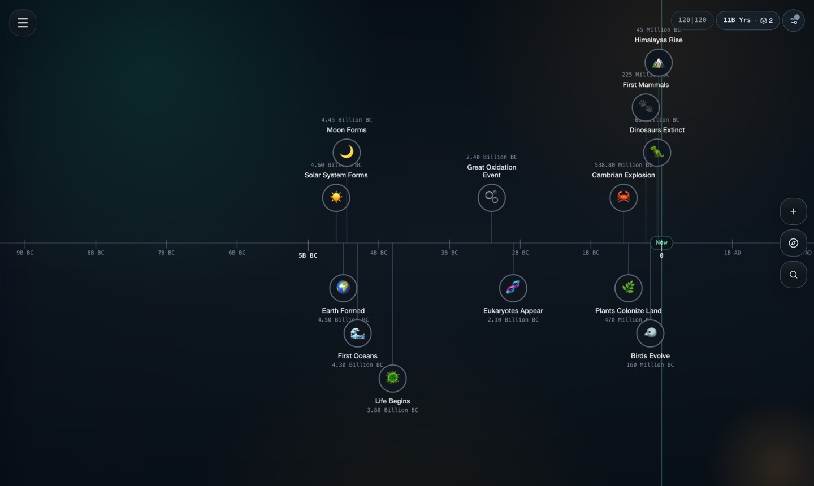
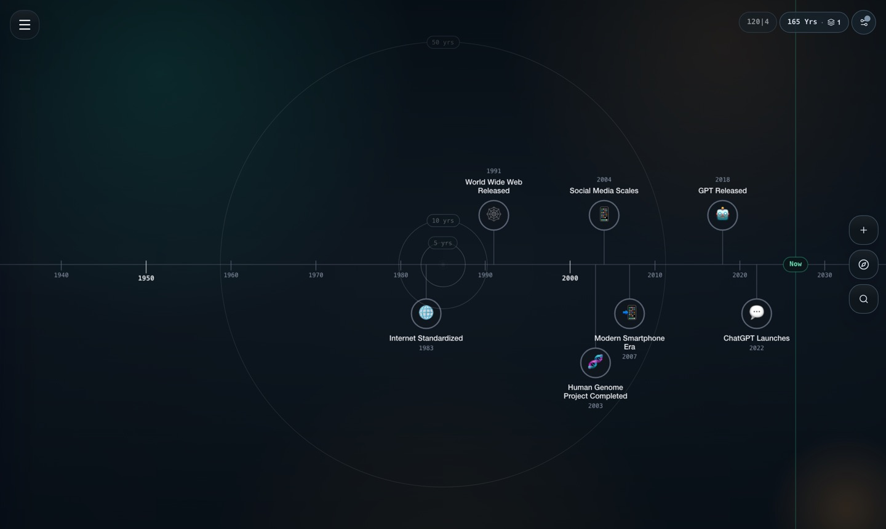
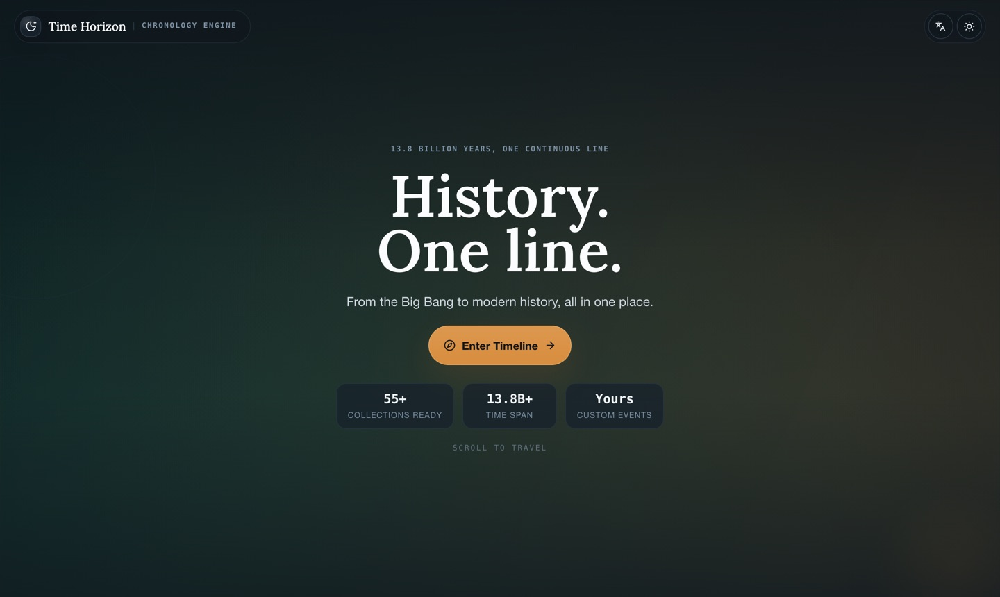

<div align="center">

# Time Horizon

### One timeline. 13.8 billion years. Down to a single second.

Scroll from the Big Bang to this afternoon on one continuous canvas — no page breaks,
no scale switches, no reloading. Stack the Roman Empire, the history of paper, and the
Cambrian explosion on the same axis and watch where they land.

**[→ Open the timeline](https://hoangtran99.is-a.dev/time-horizon/)**

[](https://github.com/HoangTran0410/time-horizon/actions/workflows/deploy.yml)




</div>

---

## Why it feels different

Most timelines are pictures of time. This one is a **camera flying through it**.

The whole view is two numbers — the year at the centre of the screen and the log of
pixels-per-year — and every gesture just moves them. Because zoom lives in log space, a
single flick of the wheel can cross nine orders of magnitude without ever changing
mode, breaking the layout, or asking you which "era" you'd like to see.

Zoom far enough out and 300,000 years of human history collapses into one pixel. Zoom
in and it unfolds again, event by event, with concentric rings marking the scale you're
standing in — the same axis as the picture above, eight orders of magnitude closer.



## What you can do with it

- **Fly across 13.8 billion years** — wheel, drag, pinch, or jump straight to a date.
  Everything is rendered to a single canvas, so density never costs you frames.
- **Layer collections** — cosmology, empires, inventions, art, religion, Vietnamese
  school history. Turn them on together and compare, or keep one at a time.
- **Put history on a map** — spatial mode anchors events to real coordinates and drifts
  the map as you travel through time.
- **Bring your own** — create events and collections, import JSON or CSV, edit anything,
  and sync it to your own Google Drive. Your data never touches a server we run,
  because there isn't one.
- **Share the exact view** — the year, the zoom, the visible collections and the focused
  event all live in the URL. Paste it and the other person lands on the same frame.
- **Read it in your language** — full Vietnamese and English, for both the interface and
  the event content itself.



## Run it locally

Collection data lives in a **separate repository**, mounted here as a submodule.

```bash
git clone https://github.com/HoangTran0410/time-horizon.git
cd time-horizon
npm install
git submodule update --init   # populates data/

node data/server.cjs          # CORS static server for the data, on :5500
npm run dev                   # app on :3000
```

Both need to be running: without the data server on `:5500` the catalog comes up empty.

```bash
npm run lint     # tsc, no ESLint
npm test         # vitest
npm run build    # production build into dist/
```

## How it is built

No backend, no database, no accounts. Everything runs in the browser and persists to
`localStorage`, with optional Google Drive sync using a `drive.file` scope — the app can
only ever see the files it created.

| | |
|---|---|
| **UI** | React 19 · TypeScript · Tailwind v4 · `motion` |
| **Build** | Vite 6 → GitHub Pages and Cloudflare Pages |
| **State** | one Zustand store, `immer` + `persist`, with every rehydrated field re-validated |
| **Rendering** | the timeline is drawn to a single `<canvas>` with manual hit-testing; React DOM handles only the panels around it |
| **Camera** | `focusYear` + `logZoom` as motion values; ticks, layout and clustering run inside rAF, outside React rendering |
| **Maps** | maplibre-gl, lazily loaded so it stays off the main chunk |

Working on the code? [`CLAUDE.md`](CLAUDE.md) is the architecture guide — the store
layout, the event identity rules, the viewport engine, and the traps worth knowing
about before you touch them.

## Data

Collections live in **[time-horizon-data](https://github.com/HoangTran0410/time-horizon-data)**
as plain JSON, one file per collection plus a metadata index. Adding history is a pull
request against that repo — no build step, no code change here.

## License

MIT
